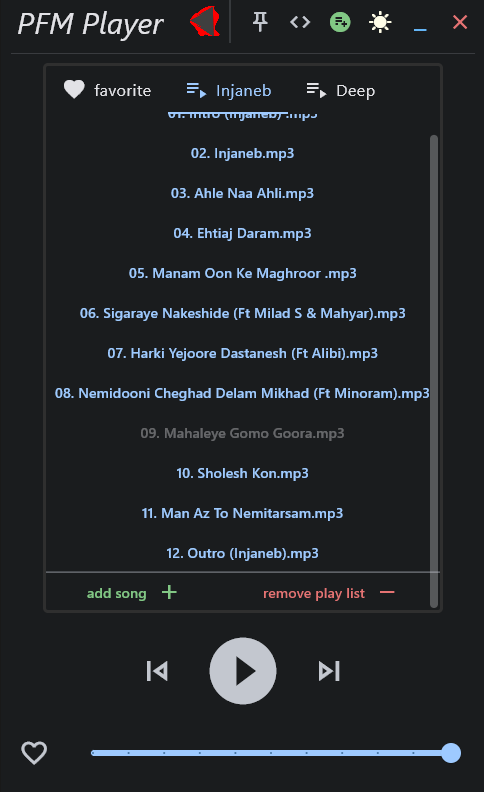
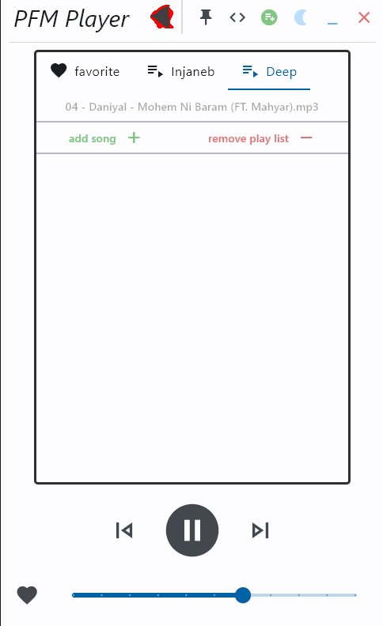

# PFM-Player
A Music Player Maked With FrameWork Flet in python

---

## `Preview`

   Dark Them                       |  Light Them
:---------------------------------:|:-----------------------------------:
  |  


## `Requirements`

- Use python3

- install python packages

```
pip install -r requirements.txt
```

## `Running`
```
python3 center.py | flet center.py
```

In first run You Must Add a Song , Click on it and Restart App

## TODO
- [ ] Fix Bug Add song reported in file center.py
- [ ] Fix Bug need restart in first time run(beacuse no exist song)
- [ ] Fix or Report Another Bugs
- [ ] Add img evry song around it
- [ ] Add button remove song around it
- [ ] Complate Operation Like Button
- [ ] Complate Operation Minimize Button
- [ ] Add Progress Bar And Control Back and forth song
- [ ] Add Name And Metadata song In UI between btn controls and playList